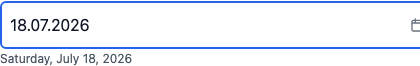
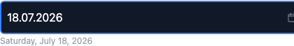
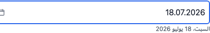

# react-locale-datepicker

A React date picker that localizes itself from the **`Intl` API** — every locale
the browser knows, no locale files to register, right-to-left aware, zero runtime
dependencies beyond React.

[](https://www.npmjs.com/package/react-locale-datepicker)
[](https://github.com/ysalitrynskyi/react-locale-datepicker/actions/workflows/ci.yml)
[](./LICENSE)

| Light | Dark | RTL (Arabic) |
| --- | --- | --- |
|  |  |  |

## Install

```bash
npm install react-locale-datepicker
# or: pnpm add react-locale-datepicker
# or: yarn add react-locale-datepicker
```

**Peers:** `react` and `react-dom` `>=18`.

## Quick start

```tsx
import { useState } from "react";
import { LocaleDatePicker } from "react-locale-datepicker";
import "react-locale-datepicker/styles.css";

export function Example() {
  const [value, setValue] = useState<Date | null>(null);

  return (
    <LocaleDatePicker
      value={value}
      onChange={setValue}
      locale="de"
      placeholder="dd.mm.yyyy"
      aria-label="Travel date"
    />
  );
}
```

Import the stylesheet once (app root or the module that mounts the picker).
Without it the component is intentionally unstyled — that is the headless
escape hatch.

### CommonJS

```js
const { LocaleDatePicker, resolveLocale } = require("react-locale-datepicker");
require("react-locale-datepicker/styles.css");
```

## Why another date picker

Most React date pickers ask you to import and register a locale bundle per
language. That is fine for two or three languages and painful for thirty. This
one derives month names, weekday names, the first day of the week and the
long-form date echo from `Intl.DateTimeFormat` at runtime, so adding a language
means passing a different string.

- **Localization with no locale files.** Names, week start and echo from `Intl`.
- **RTL by construction.** Arabic and Hebrew lay out correctly.
- **One tap to select.** Clicking a day commits and closes — no confirm step.
- **Typing that survives mobile.** Digits mask into `dd.MM.yyyy`; Eastern
  Arabic-Indic digits normalize to ASCII.
- **Readable echo.** The committed date is restated in words under the field.
- **Timezone-safe values.** Local-midnight `Date` objects — never a silent
  day-shift from a UTC round trip.
- **Caller-owned disabled days.** `shouldDisableDate` is the single authority.
- **Accessible.** Keyboard map (arrows, Page/Shift+Page, Home/End, Enter,
  Escape), ARIA pass-through, focus returns to the input on close.
- **Self-contained CSS.** `--rldp-*` tokens, light/dark (OS + class/attribute),
  `classNames` / `icons` overrides. Zero runtime dependencies.

## Props (essentials)

| Prop | Type | Notes |
| --- | --- | --- |
| `value` | `Date \| null` | **Local midnight.** Read with `getDate` / `getMonth` / `getFullYear`. |
| `onChange` | `(date: Date \| null) => void` | Fires on commit, not every keystroke. |
| `locale` | `string` | Any BCP 47 tag. Non-standard aliases are normalized (e.g. `ua` → `uk`). |
| `placeholder` | `string` | Required. Display format is fixed `dd.MM.yyyy`; supply a matching hint. |
| `shouldDisableDate` | `(date: Date) => boolean` | Sole authority on selectability. |
| `minDate` / `maxDate` | `Date \| null` | Bound month/year navigation only — do not override the predicate. |
| `defaultCalendarMonth` | `Date \| null` | Month shown when opening with no value. |
| `disabled` | `boolean` | |
| `hasError` | `boolean` | Visual only. |
| `onBlur` | `(current: Date \| null) => void` | Receives the **just-committed** value. |
| `onDisabledOpenAttempt` | `() => void` | Fires when a disabled picker is tapped. |
| `aria-label` / `aria-invalid` / `aria-describedby` | | Pass through to the input. |
| `className` | `string` | Root element. |
| `classNames` | `Partial<Record<Slot, string>>` | Per-slot overrides (appended after built-ins). |
| `icons` | `Partial<Record<IconName, ReactNode>>` | Substitute calendar / chevron glyphs. |

Full contract: [`docs/API.md`](docs/API.md).

### Locale helper

```ts
import { resolveLocale } from "react-locale-datepicker";

resolveLocale("ua"); // "uk" — safe for your own Intl calls
resolveLocale("en_US"); // "en" — malformed tags fall back instead of throwing
```

Never pass a raw caller-supplied locale into `Intl` without this (or equivalent)
normalization: a bad tag throws and can take down a whole React island.

### Constraints example

```tsx
<LocaleDatePicker
  value={value}
  onChange={setValue}
  locale="en"
  placeholder="dd.mm.yyyy"
  minDate={new Date(2026, 0, 1)}
  maxDate={new Date(2026, 11, 31)}
  shouldDisableDate={(d) => d.getDay() === 0 || d.getDay() === 6}
  aria-label="Appointment date"
/>
```

## Theming

Import the stylesheet, then override tokens on any ancestor (or on the root via
`className`):

```css
.my-form {
  --rldp-accent: oklch(0.55 0.18 250);
  --rldp-radius: 0.5rem;
}
```

Dark mode is CSS-only:

- follows the OS via `color-scheme` + `light-dark()`;
- override with a `.dark` / `.light` class or `[data-theme="dark|light"]` on an
  ancestor (compatible with next-themes and similar).

See `src/styles.css` for the full `--rldp-*` token list. Slot overrides:

```tsx
<LocaleDatePicker
  classNames={{
    input: "my-input",
    daySelected: "my-selected-day",
    echo: "my-echo",
  }}
  /* ... */
/>
```

## Keyboard

| Key | Action |
| --- | --- |
| Arrow keys | Move by day / week (RTL-aware) |
| PageUp / PageDown | Previous / next month |
| Shift+PageUp / PageDown | Previous / next year |
| Home / End | Start / end of locale week |
| Enter / Space | Commit focused day |
| Escape | Close and return focus to the input |
| ArrowDown (from input) | Open, then enter the grid |

## Display format

Today the typed/display format is fixed **`dd.MM.yyyy`**. A locale-derived or
custom format contract is on the roadmap ([`docs/ROADMAP.md`](docs/ROADMAP.md)).
Always set `placeholder` to match.

## Browser support

Modern evergreen browsers with `Intl.DateTimeFormat` and `Intl.Locale` week
info (Chrome, Firefox, Safari, Edge). Tested in CI across Chromium, Firefox and
WebKit at 320 / 768 / 1280 px.

## Development

```bash
npm install
npm run check          # typecheck + lint + unit tests
npm run test:tz        # unit suite under UTC, America/Los_Angeles, Asia/Tokyo
npm run test:e2e       # Playwright matrix
npm run build          # tsup → dist/ (ESM + CJS + d.ts + styles.css)
```

## Documentation

| Document | What it covers |
| --- | --- |
| [`docs/API.md`](docs/API.md) | Full public API and contracts |
| [`docs/PLAN.md`](docs/PLAN.md) | Implementation plan and status |
| [`docs/DECISIONS.md`](docs/DECISIONS.md) | Design decisions |
| [`docs/EXTRACTION.md`](docs/EXTRACTION.md) | Parity contract (must not regress) |
| [`docs/TESTING.md`](docs/TESTING.md) | Required test matrix |
| [`docs/ROADMAP.md`](docs/ROADMAP.md) | Feature and theming roadmap |
| [`docs/RELEASING.md`](docs/RELEASING.md) | Versioning and release process |

## License

[MIT](./LICENSE) © 2026 Yevhen Salitrynskyi
