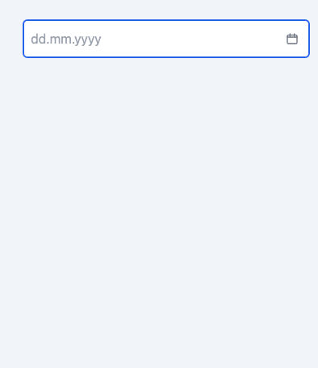
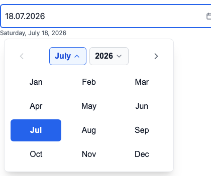
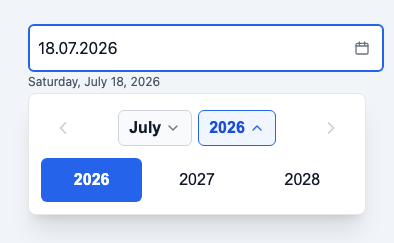
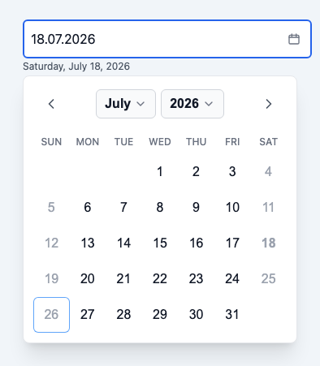
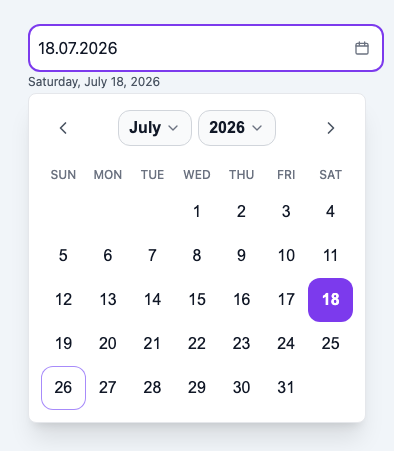
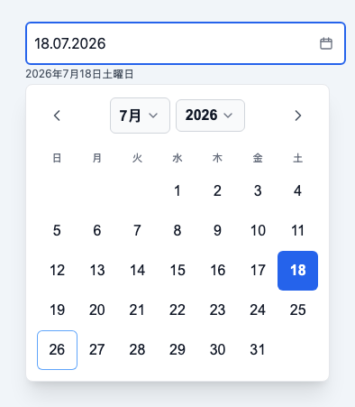
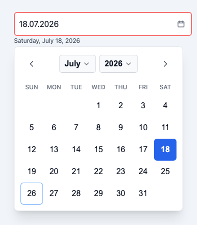

# react-locale-datepicker

A React date picker that localizes itself from the **`Intl` API** — every locale
the browser knows, no locale files to register, right-to-left aware, zero runtime
dependencies beyond React.

[](https://www.npmjs.com/package/react-locale-datepicker)
[](https://github.com/ysalitrynskyi/react-locale-datepicker/actions/workflows/ci.yml)
[](./LICENSE)

**[Live demo](https://ysalitrynskyi.github.io/react-locale-datepicker/)** —
locale switcher (including RTL), disabled days, themes and dark mode.



| Light | Dark | RTL (Arabic) |
| --- | --- | --- |
|  |  |  |

| Month view | Year view | Disabled days |
| --- | --- | --- |
|  |  |  |

| Custom theme (tokens) | Japanese | Error state |
| --- | --- | --- |
|  |  |  |

All captured from the real component by [`scripts/capture-screenshots.mjs`](scripts/capture-screenshots.mjs)
(`npm run screenshots`), including a 320 px variant at
[`docs/assets/picker-mobile.png`](docs/assets/picker-mobile.png).

## Install

```bash
npm install react-locale-datepicker
# or: pnpm add react-locale-datepicker
# or: yarn add react-locale-datepicker
```

**Peers:** `react` and `react-dom` `>=18`.

## Quick start

```tsx
import { useState } from "react";
import { LocaleDatePicker } from "react-locale-datepicker";
import "react-locale-datepicker/styles.css";

export function Example() {
  const [value, setValue] = useState<Date | null>(null);

  return (
    <LocaleDatePicker
      value={value}
      onChange={setValue}
      locale="de"
      placeholder="dd.mm.yyyy"
      aria-label="Appointment date"
    />
  );
}
```

Import the stylesheet once (app root or the module that mounts the picker).
Without it the component is intentionally unstyled — that is the headless
escape hatch.

### CommonJS

```js
const { LocaleDatePicker, resolveLocale } = require("react-locale-datepicker");
require("react-locale-datepicker/styles.css");
```

## Why another date picker

Most React date pickers ask you to import and register a locale bundle per
language. That is fine for two or three languages and painful for thirty. This
one derives month names, weekday names, the first day of the week and the
long-form date echo from `Intl.DateTimeFormat` at runtime, so adding a language
means passing a different string.

- **Localization with no locale files.** Names, week start and echo from `Intl`.
- **RTL by construction.** Arabic and Hebrew lay out correctly.
- **One tap to select.** Clicking a day commits and closes — no confirm step.
- **Business-timezone "today".** `timeZone="America/New_York"` (or a `today`
  Date) anchors the today marker and default view to the seller's calendar
  day; `todayInTimeZone` is exported for matching `shouldDisableDate` rules.
  Values stay local-midnight `Date`s — never converted.
- **Typing that survives mobile.** Digits mask into `dd.MM.yyyy`; localized
  digits normalize to ASCII for every numbering system `Intl` knows;
  separators (`.` `,` `/` `-`, Arabic and ideographic commas) close and pad
  the segment; the open calendar follows a fully typed date live.
- **Readable echo.** The committed date is restated in words under the field.
- **Timezone-safe values.** Local-midnight `Date` objects — never a silent
  day-shift from a UTC round trip.
- **Caller-owned disabled days.** `shouldDisableDate` is the single authority.
- **Accessible.** Keyboard map (arrows, Page/Shift+Page, Home/End, Enter,
  Escape), ARIA pass-through, focus returns to the input on close.
- **Self-contained CSS.** `--rldp-*` tokens, light/dark (OS + class/attribute),
  `classNames` / `icons` overrides. Zero runtime dependencies.

## Props (essentials)

| Prop | Type | Notes |
| --- | --- | --- |
| `value` | `Date \| null` | **Local midnight.** Read with `getDate` / `getMonth` / `getFullYear`. |
| `onChange` | `(date: Date \| null) => void` | Fires on commit, not every keystroke. |
| `locale` | `string` | Any BCP 47 tag. Non-standard aliases are normalized (e.g. `ua` → `uk`). |
| `placeholder` | `string` | Required. Display format is fixed `dd.MM.yyyy`; supply a matching hint. |
| `shouldDisableDate` | `(date: Date) => boolean` | Sole authority on selectability. |
| `minDate` / `maxDate` | `Date \| null` | Bound month/year navigation only — do not override the predicate. |
| `defaultCalendarMonth` | `Date \| null` | Month shown when opening with no value. |
| `timeZone` | `string` | IANA zone "today" is derived in (seller's calendar day). Never converts the value. |
| `today` | `Date` | Inject "today" outright — wins over `timeZone`. |
| `disabled` | `boolean` | |
| `hasError` | `boolean` | Visual only. |
| `showEcho` / `showWeekdayHeader` / `showTodayMarker` | `boolean` | Opt out of a built-in. All default to `true` — today's behaviour. |
| `onBlur` | `(current: Date \| null) => void` | Receives the **just-committed** value. |
| `onDisabledOpenAttempt` | `() => void` | Fires when a disabled picker is tapped. |
| `onValidationError` | `(reason) => void` | Why a typed entry did not commit: `"missing"`, `"impossible-date"`, `"not-selectable"`. |
| `aria-label` / `aria-invalid` / `aria-describedby` | | Pass through to the input. |
| `className` | `string` | Root element. |
| `themeName` | `"default" \| "minimal" \| "soft" \| "high-contrast"` | Selects a shipped theme. Unset inherits an ancestor's. |
| `classNames` | `Partial<Record<Slot, string>>` | Per-slot class overrides (appended after built-ins). |
| `styles` | `Partial<Record<Slot, CSSProperties>>` | Per-slot inline styles, same keys. |
| `labels` | `Partial<Labels>` | Strings `Intl` cannot supply — **English defaults; override for non-English UIs**. See below. |
| `icons` | `Partial<Record<IconName, ReactNode>>` | Substitute calendar / chevron glyphs. |
| `portal` | `boolean \| HTMLElement` | Opt-in escape from `overflow: hidden` ancestors. Default `false` keeps the 0.3.x in-tree popover. |

Full contract: [`docs/API.md`](docs/API.md).

### Locale helper

```ts
import { resolveLocale } from "react-locale-datepicker";

resolveLocale("ua"); // "uk" — safe for your own Intl calls
resolveLocale("en_US"); // "en" — malformed tags fall back instead of throwing
```

Never pass a raw caller-supplied locale into `Intl` without this (or equivalent)
normalization: a bad tag throws and can take down a whole React island.

### Labels — what you must translate

Month names, weekday names, the long-form echo, day accessible names, and the
**previous / next navigation** labels come from `Intl` for the `locale` you
pass. When `labels.previousMonth` / `labels.nextMonth` are omitted, the nav
buttons are named with the month and year they navigate *to* (e.g.
`"серпень 2026"` under `locale="uk"`) — not a static "Previous month" string.
You do **not** need to translate those two.

The other four defaults are English and **will ship English into a non-English
page unless you override them**:

| Key | Default | When it is heard |
| --- | --- | --- |
| `keyboardHelp` | "Use the arrow keys…" | Once, when keyboard focus first enters the day grid |
| `openCalendar` | "Open calendar" | Trigger name while empty |
| `changeDate` | "Change date" | Trigger name prefix while a date is committed |
| `closeCalendar` | "Close calendar" | Trigger name while the calendar is open |

Worked example for a Ukrainian UI (the rest of the calendar still follows
`locale="uk"` / `locale="ua"` via `Intl`):

```tsx
<LocaleDatePicker
  value={value}
  onChange={setValue}
  locale="ua"
  placeholder="дд.мм.рррр"
  aria-label="Дата початку подорожі"
  labels={{
    keyboardHelp:
      "Клавіші зі стрілками — між днями, Page Up/Down — місяць, Enter — вибір.",
    openCalendar: "Відкрити календар",
    changeDate: "Змінити дату",
    closeCalendar: "Закрити календар",
  }}
/>
```

Do not invent machine translations inside the package — the consumer owns these
four strings across their locales.

### Popover inside `overflow: hidden`

The default popover is `position: absolute` inside the component root. A card
shell like `overflow-hidden rounded-2xl` **clips** it — verified in the
browser matrix. Pass `portal` to escape:

```tsx
// Portal to document.body with position:fixed coordinates.
<LocaleDatePicker portal /* ... */ />

// Or into a host you already use for modals / stacking.
<LocaleDatePicker portal={modalRootEl} /* ... */ />
```

Default stays in-tree so existing layouts do not reflow. Keyboard model,
Escape-to-close and outside-click close keep working with either mode. Inside
a cross-origin iframe the portal targets the **iframe's** document (the only
document the script can reach).

### Constraints example

```tsx
<LocaleDatePicker
  value={value}
  onChange={setValue}
  locale="en"
  placeholder="dd.mm.yyyy"
  minDate={new Date(2026, 0, 1)}
  maxDate={new Date(2026, 11, 31)}
  shouldDisableDate={(d) => d.getDay() === 0 || d.getDay() === 6}
  aria-label="Appointment date"
/>
```

## Theming

Full guide: [`docs/THEMING.md`](docs/THEMING.md).

Import the stylesheet, then override tokens anywhere up the tree — on an
ancestor, or on the root via `className`. The nearest declaration wins.

```css
.my-form {
  --rldp-accent: oklch(0.55 0.18 250);
  --rldp-radius: 0.5rem;
}
```

Four themes ship — `default`, `minimal`, `soft`, `high-contrast` — selectable
from React or from CSS alone, and they nest:

```tsx
<LocaleDatePicker themeName="soft" /* ... */ />
```

```html
<div data-rldp-theme="high-contrast">…</div>
```

Dark mode is CSS-only:

- follows the OS via `color-scheme` + `light-dark()`;
- override with a `.dark` / `.light` class or `[data-theme="dark|light"]` on an
  ancestor (compatible with next-themes and similar).

### Tailwind v4

Tailwind v4's `@theme` reads plain CSS variables, so one block bridges the two
in either direction. Nothing Tailwind-specific ships in the package.

```css
@import "tailwindcss";
@import "react-locale-datepicker/styles.css";

@theme inline {
  --color-rldp-accent: var(--rldp-accent); /* picker tokens -> utilities */
}

.my-form {
  --rldp-accent: var(--color-indigo-600); /* your palette -> the picker */
  --rldp-radius: var(--radius-lg);
}
```

Slot overrides, per [`docs/ANATOMY.md`](docs/ANATOMY.md):

```tsx
<LocaleDatePicker
  classNames={{
    input: "my-input",
    daySelected: "my-selected-day",
    echo: "my-echo",
  }}
  styles={{ popover: { borderRadius: 16 } }}
  /* ... */
/>
```

## Keyboard

| Key | Action |
| --- | --- |
| Arrow keys | Move by day / week (RTL-aware) |
| PageUp / PageDown | Previous / next month |
| Shift+PageUp / PageDown | Previous / next year |
| Home / End | Start / end of locale week |
| Enter / Space | Commit focused day |
| Escape | Close and return focus to the input |
| ArrowDown (from input) | Open, then enter the grid |

## Display format

Today the typed/display format is fixed **`dd.MM.yyyy`**. A locale-derived or
custom format contract is on the roadmap ([`docs/ROADMAP.md`](docs/ROADMAP.md)).
Always set `placeholder` to match.

## Browser support

Modern evergreen browsers with `Intl.DateTimeFormat` and `Intl.Locale` week
info (Chrome, Firefox, Safari, Edge). Tested in CI across Chromium, Firefox and
WebKit at 320 / 768 / 1280 px.

## Development

```bash
npm install
npm run check          # typecheck + lint + unit tests
npm run test:tz        # unit suite under UTC, America/Los_Angeles, Asia/Tokyo, Asia/Kathmandu
npm run test:e2e       # Playwright matrix
npm run build          # tsup → dist/ (ESM + CJS + d.ts + styles.css)
```

### Demo

[`examples/`](examples/) is a small Vite app consuming the **built** package,
with a locale switcher (including RTL), disabled days and theme toggles. It
resolves `dist/`, so build the package first:

```bash
npm run build && cd examples && npm install && npm run dev
```

## Documentation

| Document | What it covers |
| --- | --- |
| [`docs/API.md`](docs/API.md) | Full public API and contracts |
| [`docs/ANATOMY.md`](docs/ANATOMY.md) | Published parts, slots and state attributes |
| [`docs/THEMING.md`](docs/THEMING.md) | Tokens, named themes, dark mode, Tailwind bridge |
| [`docs/PLAN.md`](docs/PLAN.md) | Implementation plan and status |
| [`docs/DECISIONS.md`](docs/DECISIONS.md) | Design decisions |
| [`docs/EXTRACTION.md`](docs/EXTRACTION.md) | Parity contract (must not regress) |
| [`docs/TESTING.md`](docs/TESTING.md) | Required test matrix |
| [`docs/ROADMAP.md`](docs/ROADMAP.md) | Feature and theming roadmap |
| [`docs/RELEASING.md`](docs/RELEASING.md) | Versioning and release process |
| [`CHANGELOG.md`](CHANGELOG.md) | What changed in each release |

## Contributing and support

Maintained as time allows: issues and pull requests are welcome, and there is
no response-time promise. Start with [`CONTRIBUTING.md`](CONTRIBUTING.md) —
the most valuable reports are locale rendering problems, day-shift timezone
bugs and screen-reader findings. Security reports go through
[`SECURITY.md`](SECURITY.md), never a public issue.

## License

[MIT](./LICENSE) © 2026 Yevhen Salitrynskyi
